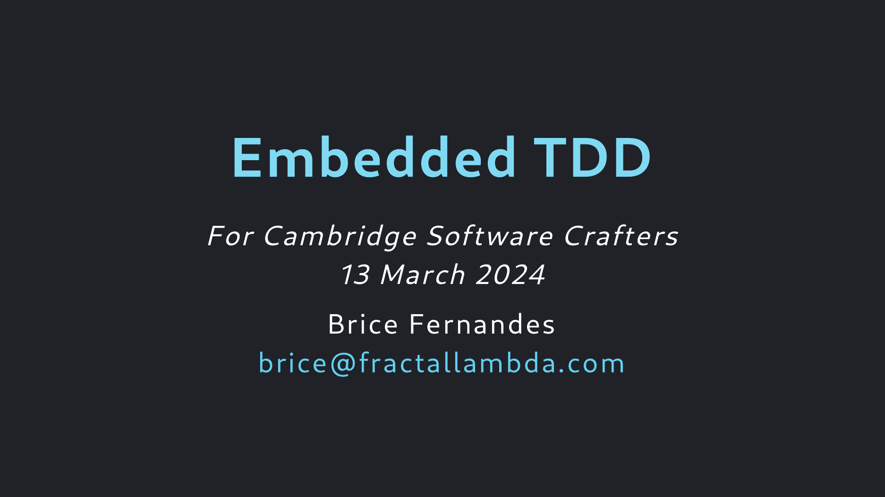

# Embedded TDD Katas

## About

This talk was created for [Cambridge Software Crafters](https://www.meetup.com/Cambridge-Software-Crafters/) and delivered there in 
[Mach 2024](https://www.meetup.com/cambridge-software-crafters/events/299178841/).

## Colophon

This talk is built in [Marp](https://marp.app/) and the PDF can be built from source by running
`make` from the `Talk` folder. 

## License

Unless otherwise specified <a property="dct:title" rel="cc:attributionURL" href="https://github.com/bricef/embedded-tdd-katas">the slides and code in this repository </a> by <a rel="cc:attributionURL dct:creator" property="cc:attributionName" href="https://fractallambda.com">Brice Fernandes</a> are licensed under <a href="http://creativecommons.org/licenses/by-sa/4.0/?ref=chooser-v1" target="_blank" rel="license noopener noreferrer" style="display:inline-block;">CC BY-SA 4.0</a>

