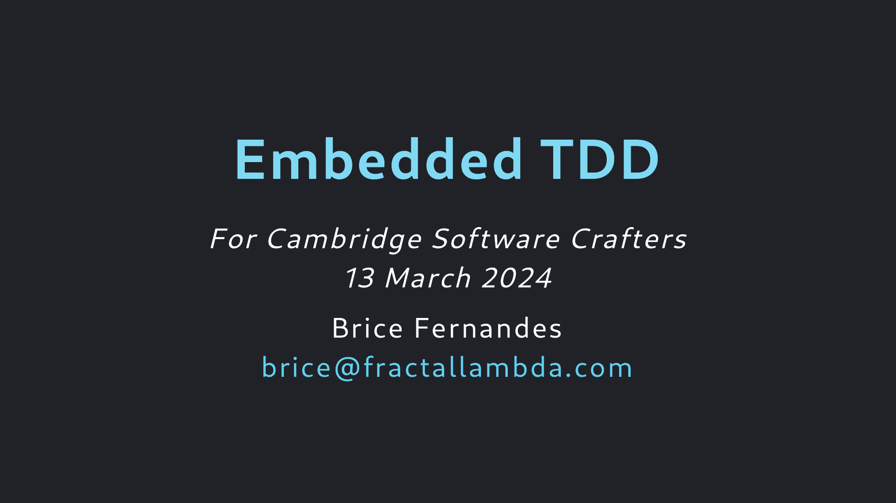

# Embedded TDD Katas

## About

This talk was created for [Cambridge Software Crafters]() and delivered there in 
[Mach 2024]().

## Colophon

This talk is built in [Marp]() and the PDF can be built from source by running
`npx marp --pdf Talk.md`. 

## License

Unless otherwise specified All contents in this repository are (c) Brice Fernandes 2024, and provided under a [Creative Commons License](./LICENSE.md).

