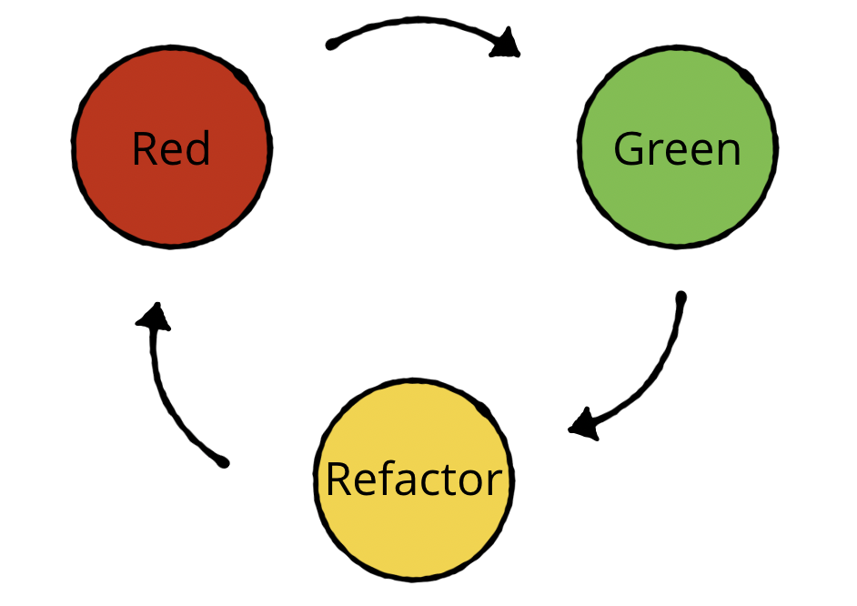

# **Embedded TDD**

_For Cambridge Software Crafters_
_13 March 2024_

Brice Fernandes 
brice@fractallambda.com

---
<!-- paginate: true -->

# Logistics and Wifi

🚽 Behind the main screen to the right of the corridor.

🛜 Wifi is **The Bradfield Centre** password is **Ca3Br1d5e**

🚨 We do not expect alarms. Assume a fire alarm is real and make your way to the car park.

---

# Plan for this evening

1. Intro
2. What we mean by embedded
3. Embeded craftsmanship practices
4. The Katas
    1. LED Driver Kata 
    2. Interrupt Kata
5. Recap

---

<!-- _class: invert -->

# Intro

---

## Why this talk?

---

# TDD Refresh - Red-Green-Refcator

Write a failing test

Make the test pass

Refactor the code

--- 

# Four phase tests

1. Setup
2. Exercise
3. Verify
4. Cleanup

---

# Ping Pong TDD

---
<!-- _class: invert -->

# What I mean by Embedded

---

# Embedded systems constraints

- Resource constraints
- Lack of standard libraries
- No or limited filesystem
- Limited Interface (serial? UART, SWI)

---
<!-- _class: invert -->

# Craftsmanship for Embedded

---

# Dual targeting

- Dual targeting
  - Target bottleneck
  - Running the test suite on the target

---

# Nested Testing Cycles

---

# CI and automated HW tests

  
---

# Advanced Mocking

Advanced Mocking
    1. Mock the clock
    2. Test doubles
      1. Code structure & Link time substitution
      2. Function pointer substitution
      3. Syntactic substitution (preprocessor)
      
---

# Simulators

---

# SOLID

  1. Single Responsibility Principle
  2. Open Closed Principle
  3. Liskov Substitution Principle
  4. Interface Segregation Principle
  5. Dependency Inversion Priciple

---
<!-- _class: invert -->

# The Katas

---
# LED Driver Kata 

---

# Interrupt Kata

---
<!-- _class: invert -->

# Recap

---

# What we learnt

--- 

# Recommended Reading

---
<!-- _class: invert -->

# Thank you 
