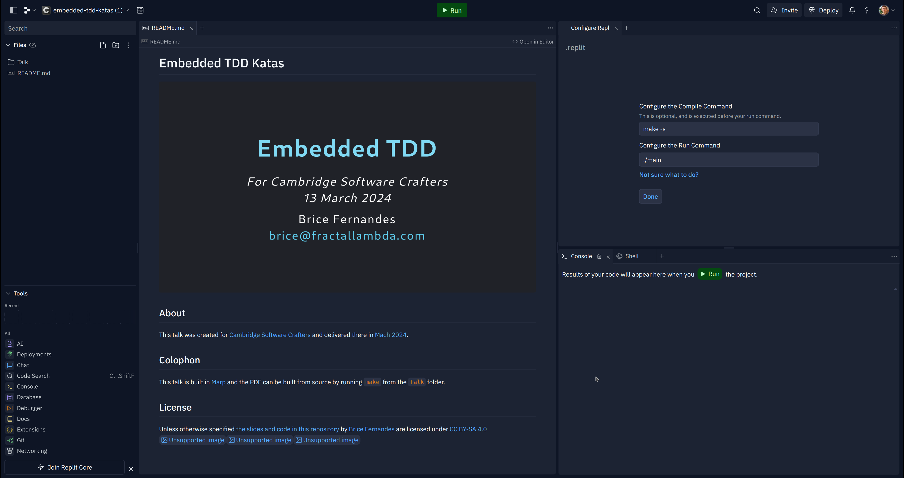

# **Embedded TDD**

_For Cambridge Software Crafters_
_13 March 2024_

Brice Fernandes 
brice@fractallambda.com

[](https://creativecommons.org/licenses/by-sa/4.0/)

---
<!-- paginate: true -->

# Logistics and Wifi

🚽 Behind the main screen to the right of the corridor.

🛜 Wifi is **The Bradfield Centre** password is **Ca3Br1d5e**

🚨 We do not expect alarms. Assume a fire alarm is real and make your way to the car park.

---


Slides and code available on Github

[github.com/bricef/embedded-tdd-katas](https://github.com/bricef/embedded-tdd-katas)

---

# Plan for this evening

1. Intro
2. What is "Embedded"
3. Embedded craftsmanship
4. Using Replit
5. The Katas
    1. LED Driver Kata 
    2. Interrupt Kata
6. Recap

---

<!-- _class: invert -->

# Why this talk?

---

<!-- _class: invert -->

# TDD Refresh

---

# TDD Loop


<span style="color: red; font-weight:bold">Write a failing test</span>

<span style="color: green; font-weight:bold">Make the test pass</span>

<span style="color: orange; font-weight:bold">Refactor the code</span>

--- 
<!-- _class: invert -->


---

# Ping Pong TDD


---
<!-- _class: invert -->

# What is "Embedded"

---

# Embedded constraints

- Resource constraints (RAM, CPU)
- Lack of standard libraries
- No or limited filesystem
- Limited Interface (serial? UART, SWI)
- No Operating System
- No standard library
- Direct hardware access
- Lack of MMU/PMMU

--- 

# Special pains

- Late hardware delivery
- Hardware scarcity
- Hardware bugs
- Long target compile times
- Long target setup and upload time
- Compiler licenses

---
<!-- _class: invert -->

# Embedded Strategy

---

# Dual targeting

- Dual targeting
  - Simulate hard-to-duplicate conditions
  - Get around target bottleneck
  - Running the test suite locally
  - Automated CI 

---

# Embedded TDD Cycles


---

# Automated HW tests

- There's no reason why you can't create an automated harness that runs the unit test on test devices.

- There's no reason why your CI builds couldn't use HW tests. Including cloud runners!

- You might want to ship tests in production devices as part of a HW self-test suite.
  
_We won't go into depth in this topic tonight._  

---

# Test Doubles


- Crititcal for embedded
- Mock the HAL
- Mock the clock

---

# How to Mock?

In order of preference

  1. Link time substitution
  (Requires appropriate code structure)
  2. Function pointer substitution
  3. Syntactic substitution (preprocessor)

Combine at will...
      
---

# Simulators

Allow testing compiled target code in CI.

Run entire test suite.

Go hand-in-hand with Test Doubles.

---

# TDD Test Cycles


---
<!-- _class: invert -->

# Craftsmanship fundamentals still matter

---

# SOLID

  1. Single Responsibility Principle
  2. Open Closed Principle
  3. Liskov Substitution Principle
  4. Interface Segregation Principle
  5. Dependency Inversion Priciple


---
<style scoped>
h1{
  margin-top: 500px;
  color: white;
}
</style>


# Let's get the party started!

---
<!-- _class: invert -->

# Using Replit

Create a [replit.com](https://replit.com/) account 

(use a throwaway email if you'd like)

---


---
<style scoped>
h1{
  margin-top: 500px;
  color: white;
}
</style>

# 1. Create a new Repl

---


<style scoped>
h1{
  margin-top: 500px;
  color: white;
}
</style>
# 2. Import from Github
---


<style scoped>
h1{
  margin-top: 0px;
  color: white;
}
pre {
  font-size: xxx-large;
  margin-top:450px;
}
</style>
# 3. Choose "From URL"

```
https://github.com/bricef/embedded-tdd-katas.git
```
---


<style scoped>
h1{
  margin-top: 0px;
  color: white;
}
pre {
  margin-top:450px;
  font-size: xxx-large;
}
</style>
# 4. Choose 'C' as a language

```
https://github.com/bricef/embedded-tdd-katas.git
```

---

<!-- project page -->


---

<!-- clone repo -->
# Local alternative
If you're confident in your local toolchain

Clone the repository locally:
```shell
$ git clone https://github.com/bricef/embedded-tdd-katas.git
```

---

<style scoped>
h1{
  margin-top: 0px;
  color: white;
  text-align:left;
}
h2 {
  margin-top:450px;
  color:white;
  text-align:right;
  font-size: xxxx-large;
}
</style>
# KEEP CALM
## IT'S DEMO TIME


---

<!-- _class: invert -->

# The Katas

---

# LED Driver Kata 

Look at `KATA.md` in `Code/src/leddriver` 

---

# Interrupt Kata

Look at `KATA.md` in `Code/src/interrupt` 

---
<!-- _class: invert -->

# Recap

---

# What we learnt

1. TDD is possible and _useful_ for embedded software.
2. Embedded TDD strategies make the process easier.
3. Dual targeting is worth it.

(C is fun, maybe?)

--- 

### Further Reading


- [TDD for Embedded C](https://pragprog.com/titles/jgade/test-driven-development-for-embedded-c/)
- [ThrowTheSwitch.org](https://www.throwtheswitch.org/)
- [Unity Test Framework](https://github.com/ThrowTheSwitch/Unity)


---
<!-- _class: invert -->

# Thank you 🙏

## Q&A❓

#### I'm available for contracting brice@fractallambda.com  

--- 
<style scoped>
  .attribution {
    font-size: large;
    text-align: left;

  }
</style>
### Attributions

<div class="attribution">

Arrange Act Assert - Own work - CC Attribution-Sharealike

Demo Time - Still frame taken from the film "Airplane!" 1980 -  © Paramount Pictures - Used under fair use for teaching.

Party Time by	Irtiza Haider - CC Attribution-Sharealike -  - [Wikimedia Commons](https://commons.wikimedia.org/wiki/File:Party_all_night.jpg)

Ping-pong TDD - Own work - CC Attribution-Sharealike - Created using [Mermaid.js](https://mermaid.js.org/)

Red-green-refactor - © [Kodeco](https://www.kodeco.com/books/android-test-driven-development-by-tutorials/v2.0/chapters/3-what-is-tdd) - Used under fair use for teaching.

Replit Screenshots - Own work - Created under fair use for teaching.

TDD for Embedded C Book Cover - © [2011 Pragmatic Bookshelf](https://pragprog.com/titles/jgade/test-driven-development-for-embedded-c/) - Used under fair use for teaching.

TDD Cycles - © [2011 Pragmatic Bookshelf](https://pragprog.com/titles/jgade/test-driven-development-for-embedded-c/) - Used under fair use for teaching.

Mockingbird by Ryan Hagerty - Public Domain - [National Digital Library of the United States Fish and Wildlife Service](https://digitalmedia.fws.gov/cdm/)

</div>

